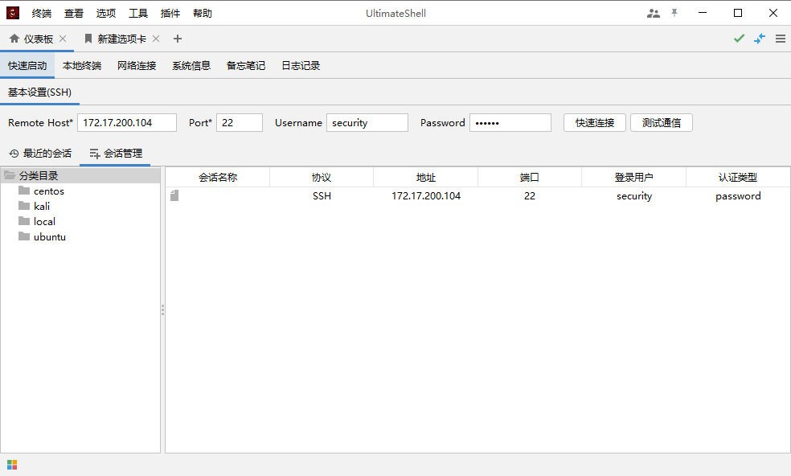
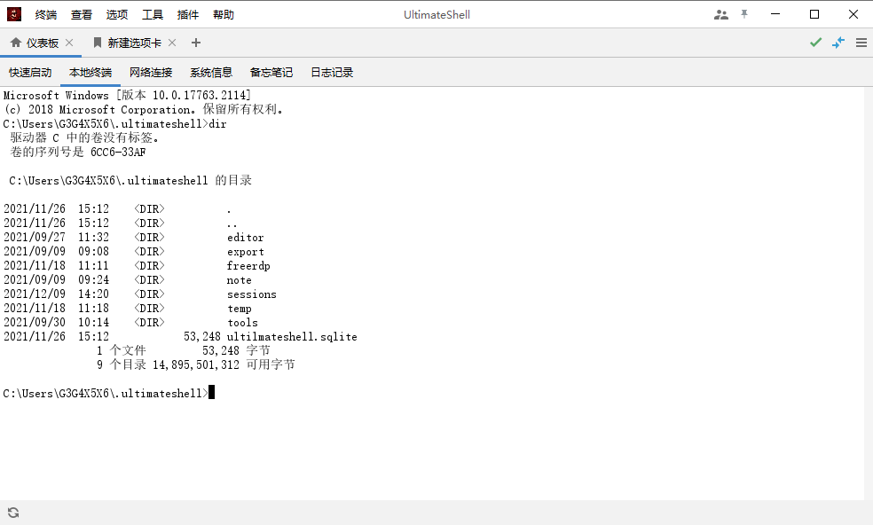
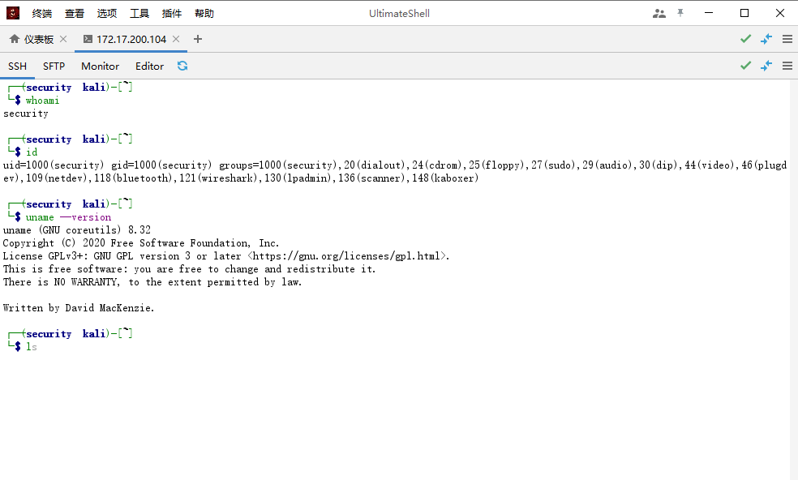
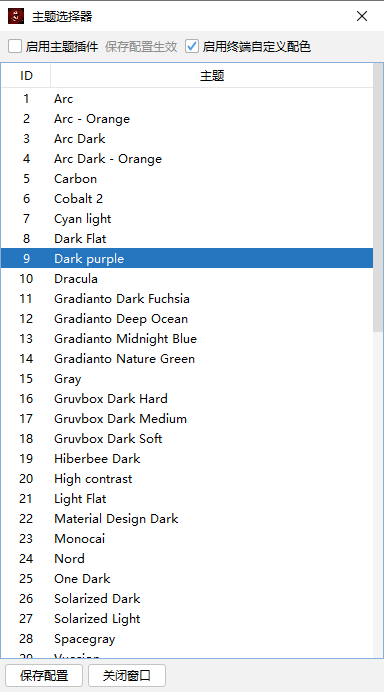
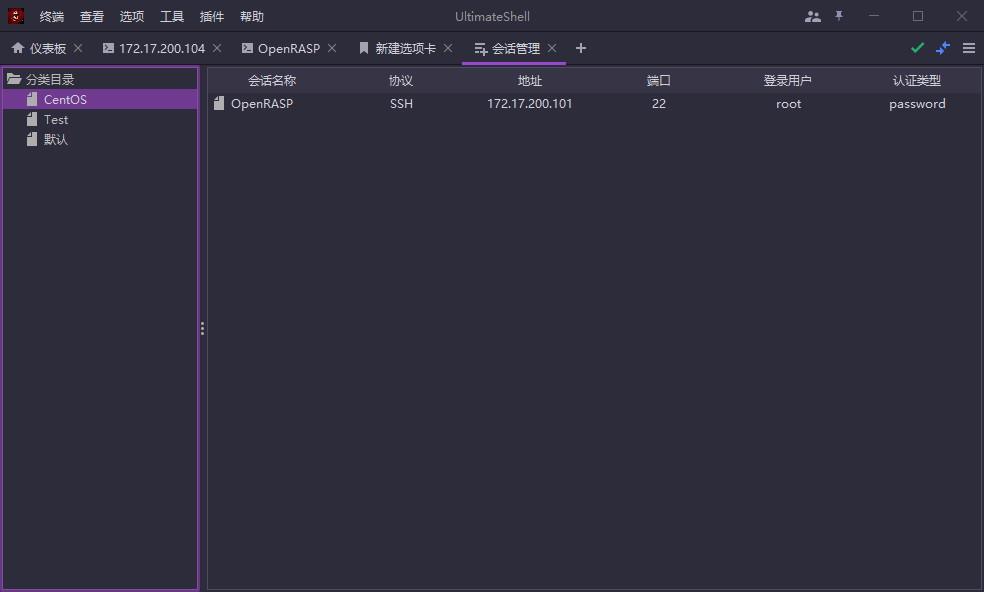
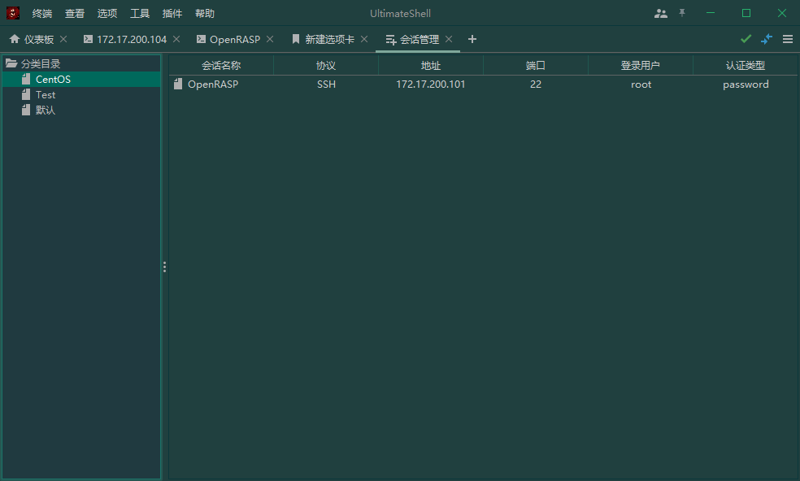

# UltimateShell


[](https://app.travis-ci.com/G3G4X5X6/ultimateshell)


[](https://github.com/RichardLitt/standard-readme)
<br>
简体中文 [English](doc/README_en.md)

<br>
UltimateShell 是一个完全开源的远程管理服务器终极工具箱。
<br><br>
UltimateShell 是您远程管理服务器的终极工具箱。其目标是为渗透测试工程师、程序员、网站管理员、IT 管理员以及几乎所有需要以更简单的方式处理远程工作的用户提供大量定制功能。并且，它还支持多种操作系统平台和基于FlatLaf的60多种主题皮肤切换。

## 目录
- [安全通告](#安全通告)
- [功能特性](#功能特性)
- [截图](#截图)
- [项目构建](#构建)
- [使用](#使用)
- [依赖](#依赖)
- [维护者](#维护者)
- [贡献者](#贡献者)
- [开源许可](#开源许可)

## 安全通告
见 [安全文件](SECURITY.md)!

## 功能特性

- [x] 支持多操作系统平台，兼容性测试：`Windows` > `Linux` > `MacOS`
- [x] 支持60多种主题皮肤切换
- [x] 支持账户会话管理
- [x] 支持本地终端(cmd, shell)
- [x] 支持 `SSH`、 `Sftp`，`SSH` 内置代码编辑器，支持代码高亮、折叠等功能
- [x] 支持串口调试（自动检测存在的 `COM` 接口）
- [x] 支持 `Telnet`
- [x] 支持 `RDP` 远程桌面（`FreeRDP`）
- [x] 支持 `VNC`，基于`TightVNC Viewer` 实现
- [ ] <del>Support FTP</del>（暂不支持）

## 正式版录屏
[comment]: <> (https://github.com/G3G4X5X6/ultimateshell/blob/gh-pages/20220107_220007.mp4?raw=true)
<video width="800" controls>
  <source src="https://github.com/G3G4X5X6/ultimateshell/blob/gh-pages/20220107_220007.mp4?raw=true" type="video/mp4">
</video>

## 截图

- *启动面板*

  

- *本地终端*

  

- *SSH 会话*

  

- *主题皮肤设置*<Br>



- *Dark purple*

  

- *Gradianto nature green*



## 构建

```shell
# 1. JDK 11+
# 2. 需要先安装依赖包到本地仓库: jediterm-pty-2.49.jar, jediterm-ssh-2.49.jar, terminal-2.54.jar, jediterm-typeahead-2.54.jar
```

## 使用

```shell
# 运行环境： JDK 11+ 
# 1. 命令行执行
java -jar UltimateShell-${version}-SNAPSHOT-jar-with-dependencies.jar

# 2. 双击执行
```
详细使用技巧查看 [项目WIKI](https://github.com/G3G4X5X6/ultimateshell/wiki)

## 致谢
- JediTerm: [https://github.com/JetBrains/jediterm](https://github.com/JetBrains/jediterm)
- FlatLaf: [https://github.com/JFormDesigner/FlatLaf](https://github.com/JFormDesigner/FlatLaf)
- Apache MINA SSHD: [https://github.com/apache/mina-sshd](https://github.com/apache/mina-sshd)
- RSyntaxTextArea: [https://github.com/bobbylight/RSyntaxTextArea](https://github.com/bobbylight/RSyntaxTextArea)
- 还有很多...


## 维护者
维护者
[@G3G4X5X6](https://github.com/G3G4X5X6)

## 贡献者

贡献者，见 [贡献者列表文件](contributing.md)!

欢迎`PRs`


## 开源许可

MIT © 2021 勾三股四弦五小六
