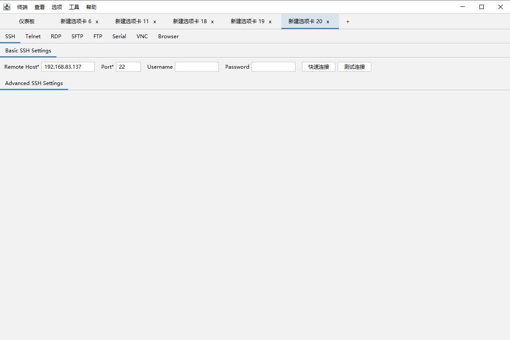

# UltimateShell



[](https://github.com/RichardLitt/standard-readme)
[](https://lgtm.com/projects/g/G3G4X5X6/G3G4X5X6.github.io/alerts/)

UltimateShell

TODO: Fill out this long description.

## Table of Contents

- [Security](#security)
- [Background](#background)
- [Install](#install)
- [Usage](#usage)
- [Maintainers](#maintainers)
- [Contributing](#contributing)
- [License](#license)

## Security
See [the security file](SECURITY.md)!

## Background

## Install

```
```

## Usage

```
```

## Maintainers

[@G3G4X5X6](https://github.com/G3G4X5X6)

## Contributing

See [the contributing file](contributing.md)!

PRs accepted.

Small note: If editing the README, please conform to the [standard-readme](https://github.com/RichardLitt/standard-readme) specification.

## License

MIT © 2021 勾三股四弦五小六
