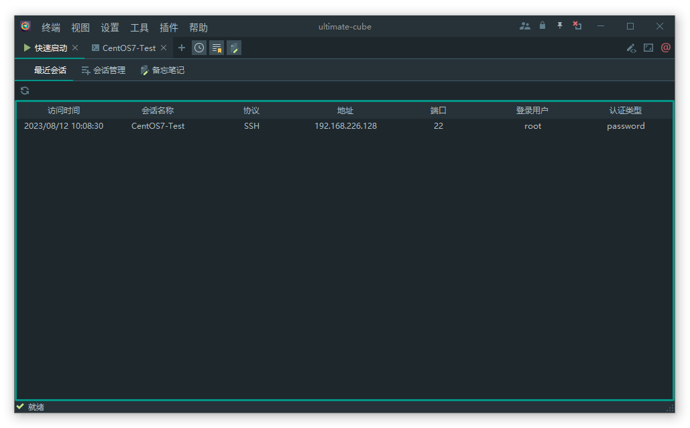
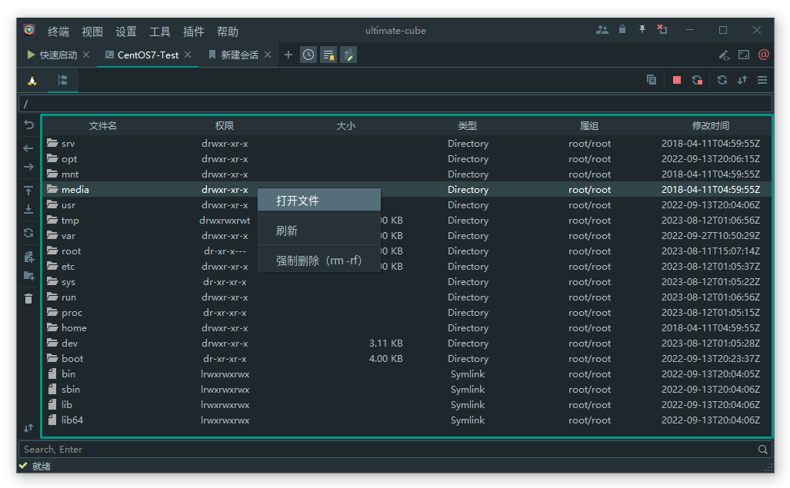

# ultimate-cube

简体中文 [English](README.en.md)

#### 介绍

ultimate-cube 是开源的远程服务器管理工具箱，目标是为渗透测试工程师、程序员、网站管理员、IT 管理员以及几乎所有需要以更简单的方式处理远程工作的用户提供大量定制功能。

#### 软件架构

软件架构说明

#### 功能特性

- [x] 支持多操作系统平台，兼容性测试：`Windows` > `Linux` > `MacOS`
- [x] 支持会话管理
- [x] 支持本地终端(cmd, bash)
- [x] 支持 `SSH`、 `Sftp`，及` 内置代码编辑器`，支持代码高亮、折叠等功能
- [x] 支持  `COM`  口调试（自动检测存在的 `COM` 接口）
- [x] 支持 `Telnet`
- [x] 支持 `RDP` 远程桌面（基于`FreeRDP` 实现）
- [x] 支持 `VNC`，基于`TightVNC Viewer` 实现
- [x] 支持 `集成外部工具`，实现快速启动
- [x] 内置 `简易编辑器` ，可编辑本地、远程文本文件
- [x] <del>内置 `Nuclei` GUI，POC概念验证框架，已开启独立项目</del>
- [x] 支持60多种主题皮肤切换

#### 未来计划

- [ ] 持续优化及精简程序架构
- [ ] 支持插件系统
- [ ] 支持国际化
- [ ] 友好提示异常及报错信息

#### 安装教程

1. 程序依赖运行环境：`JDK11+`
1. `linux`, `OSX` 用户建议使用自带依赖的通用版本 ultimate-cube-x.x.x-jar-with-dependencies.jar
1. `Windows` 用户 `无JDK` 环境的,建议使用 `ultimate-cube_setup.exe` 安装包（体积较大）

#### 使用说明

##### 快速启动



##### 新建会话


##### SSH


##### SFTP



#### 构建

1. 构建环境：`JDK11+`, `IDEA`
2. 安装依赖：
   ```shell
    # tightvnc-jviewer.jar, jediterm-pty-2.66.jar, com.jediterm.terminal-2.66.jar, jediterm-typeahead-2.66.jar
    mvn install:install-file -Dfile=libs/tightvnc-jviewer.jar -DgroupId=com.g3g4x5x6  -DartifactId=tightvnc-jviewer -Dversion=2.8.3 -Dpackaging=jar
    # mvn install:install-file -Dfile=libs/jediterm-typeahead-2.66.jar -DgroupId=com.g3g4x5x6  -DartifactId=jediterm-typeahead -Dversion=2.66 -Dpackaging=jar
    # mvn install:install-file -Dfile=libs/jediterm-pty-2.66.jar -DgroupId=com.g3g4x5x6  -DartifactId=jediterm-pty -Dversion=2.66 -Dpackaging=jar
   ```
3. 编译运行：
    1. 统一修改各模块版本号：`mvn versions:set -DnewVersion=6.6.11`
    1. 运行 `maven` 插件 `templating` 编译 `Version.java` 文件
    1. 安装新版本依赖：`mvn install`
    1. `IDEA` 菜单中 `Build Proect` 项目，复制静态文件到 `target` 目录
    1. 运行项目或者打包（`maven` 插件 `assembly:assembly`）


1. 程序更新后，若无法正常连接SSH，请备份删除原配置文件 `application.properties`。
2. 关于使用过程中的任何疑问，请于 GitHub 中的 `Discussions` 中的对应版本进行提问和反馈。
3. 任何 `Issues` 请到 github 项目仓库中提出，此仓库仅作为源码存储仓库。

#### 参与贡献

1. Fork 本仓库
2. 新建 Feat_xxx 分支
3. 提交代码
4. 新建 Pull Request

